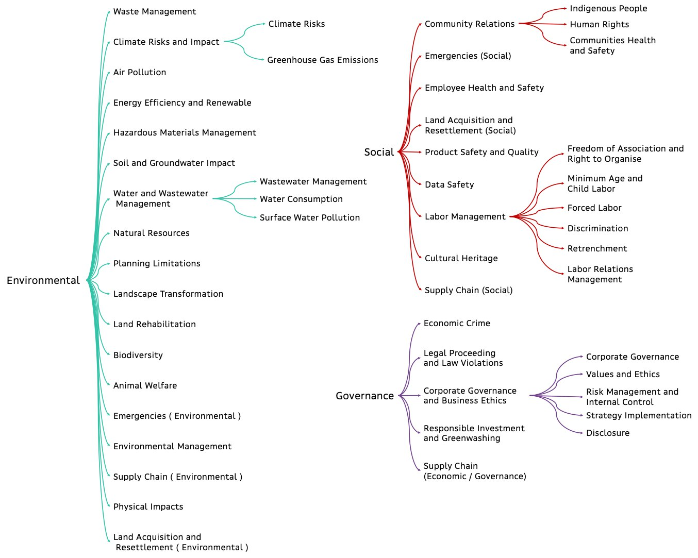

# About ESGify

**ESGify** is a model for multilabel news classification with respect to ESG risks. Weights are uploaded on Huggingface https://huggingface.co/ai-lab/ESGify/ 
Our custom methodology includes 46 ESG classes and 1 non-relevant to ESG class, resulting in 47 classes in total:



# Usage 

ESGify is based on MPNet architecture but with a custom classification head. The ESGify class is defined is follows.

```python
from collections import OrderedDict
from transformers import MPNetPreTrainedModel, MPNetModel, AutoTokenizer
import torch

# Mean Pooling - Take attention mask into account for correct averaging
def mean_pooling(model_output, attention_mask):
        token_embeddings = model_output #First element of model_output contains all token embeddings
        input_mask_expanded = attention_mask.unsqueeze(-1).expand(token_embeddings.size()).float()
        return torch.sum(token_embeddings * input_mask_expanded, 1) / torch.clamp(input_mask_expanded.sum(1), min=1e-9)

# Definition of ESGify class because of custom,sentence-transformers like, mean pooling function and classifier head
class ESGify(MPNetPreTrainedModel):
    """Model for Classification ESG risks from text."""

    def __init__(self,config): #tuning only the head
        """
        """
        super().__init__(config)
        # Instantiate Parts of model
        self.mpnet = MPNetModel(config,add_pooling_layer=False)
        self.id2label =  config.id2label
        self.label2id =  config.label2id
        self.classifier = torch.nn.Sequential(OrderedDict([('norm',torch.nn.BatchNorm1d(768)),
                                                ('linear',torch.nn.Linear(768,512)),
                                                ('act',torch.nn.ReLU()),
                                                ('batch_n',torch.nn.BatchNorm1d(512)),
                                                ('drop_class', torch.nn.Dropout(0.2)),
                                                ('class_l',torch.nn.Linear(512 ,47))]))


    def forward(self, input_ids, attention_mask):
         # Feed input to mpnet model
        outputs = self.mpnet(input_ids=input_ids,
                             attention_mask=attention_mask)
         
        # mean pooling dataset and eed input to classifier to compute logits
        logits = self.classifier( mean_pooling(outputs['last_hidden_state'],attention_mask))
         
        # apply sigmoid
        logits  = 1.0 / (1.0 + torch.exp(-logits))
        return logits
```

After defining model class, we initialize ESGify and tokenizer with the pre-trained weights

```python
model = ESGify.from_pretrained('ai-lab/ESGify')
tokenizer = AutoTokenizer.from_pretrained('ai-lab/ESGify')
```

Getting results from the model:

```python
texts = ['text1','text2']
to_model = tokenizer.batch_encode_plus(
                  texts,
                  add_special_tokens=True,
                  max_length=512,
                  return_token_type_ids=False,
                  padding="max_length",
                  truncation=True,
                  return_attention_mask=True,
                  return_tensors='pt',
                )
results = model(**to_model)
```

To identify top-3 classes by relevance and their scores: 

```python
import numpy as np
for i in torch.topk(results, k=3).indices.tolist()[0]:
    print(f"{model.id2label[i]}: {np.round(results.flatten()[i].item(), 3)}")
```

For example, for the news "She faced employment rejection because of her gender", we get the following top-3 labels:
```
Discrimination: 0.944
Strategy Implementation: 0.82
Indigenous People: 0.499
```

Before training our model, we masked words related to Organisation, Date, Country, and Person to prevent false associations between these entities and risks. Hence, we recommend to process text with FLAIR NER model before inference.
An example of such preprocessing is given in https://colab.research.google.com/drive/15YcTW9KPSWesZ6_L4BUayqW_omzars0l?usp=sharing.


# Training procedure

We use the pretrained [`microsoft/mpnet-base`](https://huggingface.co/microsoft/mpnet-base) model.
Next, we do the domain-adaptation procedure by Mask Language Modeling with using texts of ESG reports. 
Finally, we fine-tune our model on 2000 texts with manually annotation of ESG specialists.
